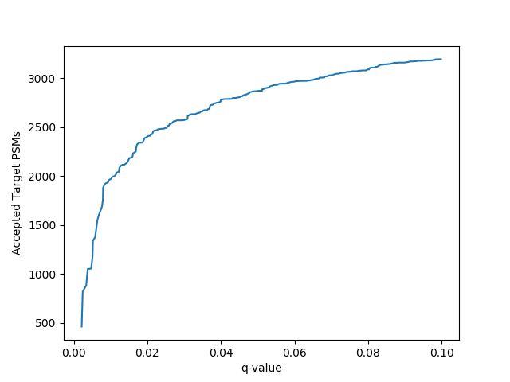

# targetdecoy
A simple Python package for proteomics confidence estimation using target decoy competition

The sole purpose of the **targetdecoy** package is to provide an easy and open means to estimate q-values for proteomics experiments using target-decoy competition. This can be useful for comparing search engines (so long as the same database was used) and evaluating results from search engines that don't provide a false discovery rate (FDR) estimate out of the box. 

## What is a q-value?
In the case of peptide detection, a q-value is the minimum FDR at which a PSM would be accepted. While FDR is a property of a set of PSMs, the q-value is a property of an single PSM. This q-value is intended to be directly analagous to a p-value, but corrected for multiple hypothesis testing. Filtering a dataset for PSMs below a q-value threshold ensures that the estimated FDR for the resulting set is less then or equal to the chosen q-value.  

Have more questions about q-values and FDR? Check out these references for a good primer:

+ Noble WS. How does multiple testing correction work? *Nat Biotechnol* 27:1135--1137 (2009) [[Journal](https://www.nature.com/articles/nbt1209-1135)]  

+ Käll L, Storey JD, MacCoss MJ, Noble WS. Posterior Error Probabilities and False Discovery Rates: Two Sides of the Same Coin. *J Proteome Res* 7(01):40--44 (2008). [[Journal](https://pubs.acs.org/doi/10.1021/pr700739d)]

## Installation
The **targetdecoy** package will soon be available on PyPI for Python versions 3.5+ and depends on the numpy, pandas and matplotlib packages. Until then, the package can still be easily installed easily with pip:

```bash
pip install git+git://github.com/wfondrie/targetdecoy
```

## Usage
Before using the **targetdecoy** package, you must have database search results from a concatenated target-decoy database. Additionally, I assume you can import these results into a Python session using tools such as pandas. Critically, you need a metric or score for each PSM describing the quality of the match and a label indicating whether the match is to a target or decoy peptide. 

With these in hand, the **targetdecoy** package currently provides a two functions: One to estimate q-values and another to plot them. In the following example, I've simulated a dataset of 10,000 PSMs:

```Python
>>> import numpy as np
>>> import matplotlib.pyplot as plt
>>> import targetdecoy

# Set seed for reproducibility
>>> np.random.seed(1)

# Arbitrary search engine scores. Higher is better
>>> target_tp_scores = np.random.randn(3000) + 6 # true target hits
>>> target_fp_scores = np.random.randn(3500) + 3 # false target hits
>>> decoy_scores = np.random.randn(3500) + 3 # decoy hits

>>> scores = np.concatenate((target_tp_scores,
...                          target_fp_scores,
...                          decoy_scores))

# Labels for the data. True indicates a target, False indicates a decoy.
>>> labels = np.concatenate((np.repeat(True, 6500), np.repeat(False, 3500)))

# Estimate q-values
>>> qvals = targetdecoy.qvalues.estimate(metric=scores, target=labels, desc=True)

# Plot q-values
>>> plt.figure()
>>> targetdecoy.qvalues.plot(qvalues=qvals, target=labels, threshold=0.1)
>>> plt.savefig("curve.png")
```
This yields:



While the **targetdecoy** package was created with PSMs in mind, it can easily be used to estimate q-values for peptides and proteins as well if you have already aggregated the data to either level.

## TODO
+ Create detailed API docs  
+ Add unit tests and Travis-CI  
+ FDR calculations for XL-MS
